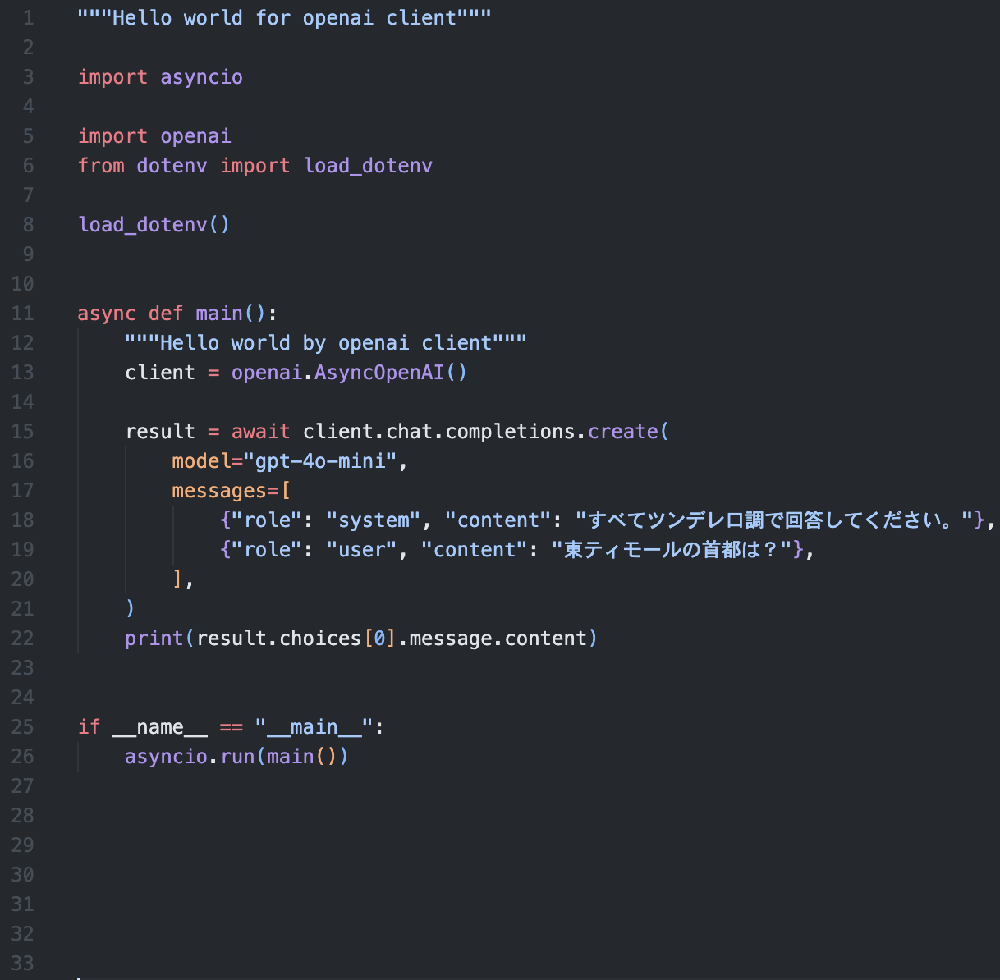
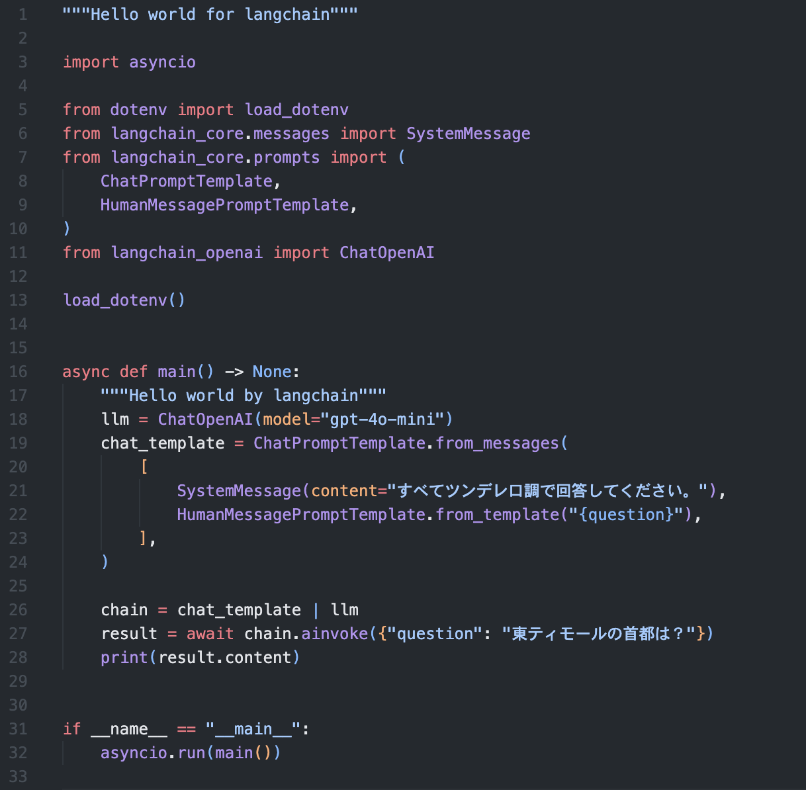

## はじめに

Python ユーザーなら誰しもお世話になっているであろうデータバリデーションフレームワークである Pydantic の開発チームから、AI エージェントフレームワーク「Pydantic AI」が登場しました。ということで、さっそく公式ドキュメントを見ながら、どのようなものか試してみました。

## PydanticAI

PydanticAI は FastAPI のように、Generative AI を用いた本番環境のアプリケーション開発をより簡単に構築できるよう設計されたフレームワークというコンセプトのようです。

公式ドキュメント

https://ai.pydantic.dev/

GitHub リポジトリ

https://github.com/pydantic/pydantic-ai

公式ドキュメントによると、PydanticAI には以下のような特徴があるようです。

> - Pydantic チームによって開発（OpenAI SDK、Anthropic SDK、LangChain、LlamaIndex、AutoGPT、Transformers、CrewAI、Instructor など多くのプロジェクトのバリデーション層を担当）
> - モデルに依存しない設計 — 現在 OpenAI、Gemini、Groq をサポート。Anthropic も近日対応予定。また、他のモデルのサポートも簡単に実装可能なインターフェースを提供
> - 型安全性を重視した設計
> - 制御フローとエージェントの構成は通常の Python で行われ、他の（AI 以外の）プロジェクトと同じ Python の開発ベストプラクティスを活用可能
> - Pydantic による構造化レスポンスのバリデーション
> - Pydantic による構造化レスポンスのバリデーションを含むストリーミングレスポンス対応
> - テストと評価駆動の反復開発に有用な、革新的で型安全な依存性注入システム
> - LLM を活用したアプリケーションのデバッグとパフォーマンス・動作の監視のための Logfire 統合

:::note info
2024 年 12 月時点で、PydanticAI は Beta 版という位置づけなので、API の変更がある可能性があります。
:::

## Installation

https://ai.pydantic.dev/install/

今回は [uv](https://github.com/astral-sh/uv) で環境構築してみます。

```shell
uv add pydantic-ai
```

執筆時点で最新のバージョンは `v0.0.11` でした。

```shell
# Display the project's dependency tree
uv tree
（省略）
├── pydantic-ai v0.0.11
│   └── pydantic-ai-slim[groq, openai, vertexai] v0.0.11
│       ├── eval-type-backport v0.2.0
│       ├── griffe v1.5.1
│       │   └── colorama v0.4.6
│       ├── httpx v0.28.1 (*)
│       ├── logfire-api v2.6.2
│       ├── pydantic v2.10.3 (*)
│       ├── groq v0.13.0 (extra: groq)
│       │   ├── anyio v4.7.0 (*)
│       │   ├── distro v1.9.0
│       │   ├── httpx v0.28.1 (*)
│       │   ├── pydantic v2.10.3 (*)
│       │   ├── sniffio v1.3.1
│       │   └── typing-extensions v4.12.2
│       ├── openai v1.57.0 (extra: openai) (*)
│       ├── google-auth v2.36.0 (extra: vertexai)
│       │   ├── cachetools v5.5.0
│       │   ├── pyasn1-modules v0.4.1
│       │   │   └── pyasn1 v0.6.1
│       │   └── rsa v4.9
│       │       └── pyasn1 v0.6.1
│       └── requests v2.32.3 (extra: vertexai) (*)
（省略）
```

## Agents

https://ai.pydantic.dev/agents/

PydanticAI における主要なインターフェースが `Agent`　です。`Agent` は単一のアプリケーションやコンポーネントを制御する役割を果たし、さらに、複数の `Agent` を組み合わせることで、より高度なワークフロー（マルチ LLM エージェント）を構築することも可能なようです。

また `Agent` の設計思想は FastAPI の `app` や`router` のように一度インスタンス化されたものをアプリケーション全体で再利用することを想定しているとのことです。

まずは、`Agent` クラスでユーザーの問いかけに対して回答する単純なエージェントを構築してみます。

```python:hello_world.py
import asyncio

from dotenv import load_dotenv
from pydantic_ai import Agent

# 補足： .envファイルから`OPENAI_API_KEY`を読み込み、環境変数にセット
load_dotenv()


async def main() -> None:
    """Hello world for pydantic ai"""
    agent = Agent(
        "openai:gpt-4o-mini",
        system_prompt=("すべてツンデレ口調で回答してください。"),
    )

    result = await agent.run("東ティモールの首都は？")
    print(result.data)


if __name__ == "__main__":
    asyncio.run(main())
```

```shell:実行結果
べ、別にあなたのために教えてあげるんじゃないんだからね！東ティモールの首都はディリよ。勘違いしないでよね！
```

モデル（ここでは `gpt-4o-mini`）とシステムプロンプトを定義した `Agent` を作成し、その `Agent` に対して `run` メソッドを呼び出すことで、出力結果を得ることができました。

他のフレームワークと比較すると、よりシンプルに記述できることが特徴のようです。同じ処理を OpenAI の Python ライブラリ、LangChain と比較するとその差がわかりやすいかと思います。

| OpenAI Python Client                                             | LangChain                                                        |
| ---------------------------------------------------------------- | ---------------------------------------------------------------- |
|  |  |

### System Prompts

システムプロンプトは前述の通り、`Agent` クラスのコンストラクタ（`system_prompt`）で渡すこともできますが、デコレータ（`@agent.system_prompt`）を使うことで、より動的で柔軟なシステムプロンプトの設定が可能です。

```python:system_prompt.py
import asyncio
from datetime import date

from pydantic_ai import Agent, RunContext

agent = Agent(
    "openai:gpt-4o-mini",
    deps_type=str,
    system_prompt="ユーザーの名前を使って返信してください。",
)


@agent.system_prompt
def add_the_users_name(ctx: RunContext[str]) -> str:
    """Return the user's name"""
    return f"ユーザーの名前は {ctx.deps} です。"


@agent.system_prompt
def add_the_date() -> str:
    """Return today's date"""
    return f"今日の日付は {date.today()} です。"


async def main() -> None:
    """Main function"""
    result = await agent.run("今日の日付は？", deps="田中")
    print(result.data)
    print(result.all_messages())


if __name__ == "__main__":
    asyncio.run(main())
```

```shell:実行結果
田中さん、今日は2024年12月8日です。何か特別な計画がありますか？
```

デコレータで追加したシステムプロンプトを反映した結果が得られました。なお エージェントに入力されたプロンプトは`result.all_messages()`で確認することができます。コード上でシステムプロンプトを定義した順にプロンプトが反映されています。

```python:result.all_messages()の出力結果
[
    SystemPrompt(
        content="ユーザーの名前を使って返信してください。", role="system"
    ),
    SystemPrompt(content="ユーザーの名前は 田中 です。", role="system"),
    SystemPrompt(content="今日の日付は 2024-12-08 です。", role="system"),
    UserPrompt(
        content="今日の日付は？",
        timestamp=datetime.datetime(
            2024, 12, 8, 12, 59, 54, 869016, tzinfo=datetime.timezone.utc
        ),
        role="user",
    ),
    ModelTextResponse(
        content="田中さん、今日の日付は2024年12月8日です。何か特別な予定がありますか？",
        timestamp=datetime.datetime(
            2024, 12, 8, 12, 59, 55, tzinfo=datetime.timezone.utc
        ),
        role="model-text-response",
    ),
]
```

### Function Tools

PydanticAI では、デコレータを使って Function Calling で使用するツールを定義することができます。デコレータはコンテキストの有無によって以下の 2 つを使い分ける必要があります。

- `@agent.tool`：agent にコンテキスト（引数）を渡す関数に指定
- `@agent.tool_plain`：agent にコンテキスト（引数）を渡さない関数に指定

以下のサンプルは、サイコロゲームを実行するエージェントの例です。コンテキストが不要なサイコロを降るツールは`@agent.tool_plain`、プレイヤーの名前を取得するツールはコンテキストが必要であるため`@agent.tool`で定義しています。

```python:dice_game.py
import asyncio
import random

from pydantic_ai import Agent, RunContext

agent = Agent(
    "openai:gpt-4o-mini",
    deps_type=str,
    system_prompt=(
        "あなたはサイコロゲームです。サイコロを振って、出た目がユーザーの予想と"
        "一致するかどうかを確認してください。一致した場合は、プレイヤーの名前を使って"
        "勝者であることを伝えてください。"
    ),
)

@agent.tool_plain
def roll_die() -> str:
    """Roll a six-sided die and return the result."""
    return str(random.randint(1, 6))


@agent.tool
def get_player_name(ctx: RunContext[str]) -> str:
    """Get the player's name."""
    return ctx.deps


async def main() -> None:
    dice_result = await agent.run("私の予想は「4」です", deps="たかし")
    print(dice_result.data)
    print(dice_result.all_messages())


if __name__ == "__main__":
    asyncio.run(main())

```

```shell:実行結果
サイコロを振った結果、出た目は「2」でした。あなたの予想「4」とは一致しませんでした。また次回チャレンジしてみてください！
```

こちらも`result.all_messages()`で実行結果を確認してみると、Function Calling が実行されていることが確認できます。

```python:result.all_messages()の出力結果
[
    SystemPrompt(
        content="あなたはサイコロゲームです。サイコロを振って、出た目がユーザーの予想と一致するかどうかを確認してください。一致した場合は、プレイヤーの名前を使って勝者であることを伝えてください。",
        role="system",
    ),
    UserPrompt(
        content="私の予想は「4」です",
        timestamp=datetime.datetime(
            2024, 12, 8, 13, 9, 30, 552546, tzinfo=datetime.timezone.utc
        ),
        role="user",
    ),
    ModelStructuredResponse(
        calls=[
            ToolCall(
                tool_name="roll_die",
                args=ArgsJson(args_json="{}"),
                tool_id="call_RqWpHqUKrvVqBjGDplXwHG67",
            ),
            ToolCall(
                tool_name="get_player_name",
                args=ArgsJson(args_json="{}"),
                tool_id="call_iER5bYY2gmcIBvtS8nQcYlmJ",
            ),
        ],
        timestamp=datetime.datetime(
            2024, 12, 8, 13, 9, 31, tzinfo=datetime.timezone.utc
        ),
        role="model-structured-response",
    ),
    ToolReturn(
        tool_name="roll_die",
        content="2",
        tool_id="call_RqWpHqUKrvVqBjGDplXwHG67",
        timestamp=datetime.datetime(
            2024, 12, 8, 13, 9, 31, 888425, tzinfo=datetime.timezone.utc
        ),
        role="tool-return",
    ),
    ToolReturn(
        tool_name="get_player_name",
        content="たかし",
        tool_id="call_iER5bYY2gmcIBvtS8nQcYlmJ",
        timestamp=datetime.datetime(
            2024, 12, 8, 13, 9, 31, 888433, tzinfo=datetime.timezone.utc
        ),
        role="tool-return",
    ),
    ModelTextResponse(
        content="サイコロを振った結果、出た目は「2」でした。あなたの予想「4」とは一致しませんでした。また次回チャレンジしてみてください！",
        timestamp=datetime.datetime(
            2024, 12, 8, 13, 9, 32, tzinfo=datetime.timezone.utc
        ),
        role="model-text-response",
    ),
]
```

ツールもシステムプロンプトと同様に、エージェントにツールをデコレータを使って定義することができるため、動的で柔軟なエージェントを作成することができます。

### Type safe by design (型安全性)

PydanticAI は Mypy などのスタティックな型チェッカーと連携するよう設計されており、agent で定義された依存関係（エージェントが受け取るデータ型: `deps_type`）や出力結果のデータ型（`result_type`）を型チェッカーでチェックすることができます。

型安全性の

```python:types_mistake.py
from dataclasses import dataclass

from pydantic_ai import Agent, RunContext


@dataclass
class User:
    name: str

agent = Agent(
    "test",
    deps_type=User,     # 依存関係の型
    result_type=bool,   # 出力結果の型
)

# agentで定義されたdeps_typeに定義された型(User)と、system_promptの引数の型(str)が一致しない
@agent.system_prompt
def add_user_name(ctx: RunContext[str]) -> str:
    return f"The user's name is {ctx.deps}."


def foobar(x: bytes) -> None:
    pass

result = agent.run_sync('Does their name start with "A"?', deps=User("Anne"))
foobar(result.data)  # agentの出力結果の型（bool）とfoobarの引数の型（bytes）が一致しないためエラーになる
```

このコードに対して `mypy` を実行すると、期待通りシステムプロンプトの依存関係の型エラーが出力されます。

```shell:mypyの実行結果
$ mypy src/types_mistake.py
src/types_mistake.py:18:2: error: Argument 1 to "system_prompt" of "Agent" has incompatible type "Callable[[RunContext[str]], str]"; expected "Callable[[RunContext[User]], str]"  [arg-type]
src/types_mistake.py:28:8: error: Argument 1 to "foobar" has incompatible type "bool"; expected "bytes"  [arg-type]
Found 2 errors in 1 file (checked 1 source file)
```

このように、型安全性を高めることで、コードのバグを防ぐことができます。

## Results (構造化レスポンス)

https://ai.pydantic.dev/results/

エージェントの最終出力結果は、Pydantic の BaseModel を指定することで、型安全性を高めることができます。
この辺は Langchain の [PydanticOutputParser](https://python.langchain.com/v0.1/docs/modules/model_io/output_parsers/types/pydantic/) と同じようなイメージです。

```python:pydantic_model.py
"""Pydantic model example"""

import asyncio

from pydantic import BaseModel
from pydantic_ai import Agent


class CityLocation(BaseModel):
    """city location"""

    city: str
    """city name"""
    country: str
    """country name"""


async def main() -> None:
    """Main function"""
    agent = Agent("openai:gpt-4o-mini", result_type=CityLocation)

    result = await agent.run("2020年のオリンピック開催地は？")
    print(result.data.model_dump())


if __name__ == "__main__":
    asyncio.run(main())

```

```shell:実行結果
{'city': '東京', 'country': '日本'}
```

### Streaming Structured Responses

構造化レスポンスはストリーミングでの出力も可能です。
Pydantic の `BaseModel` は[部分的なバリデーションをサポートしていない型](https://github.com/pydantic/pydantic/issues/10748)があります。部分的なバリデーションが必要なストリーミングレスポンスでは、現時点では TypeDict を使用することになるようです。

```python:streamed_structured_responses.py
"""Streamed user profile"""

import asyncio
from datetime import date

from pydantic_ai import Agent
from typing_extensions import TypedDict


# pydantic の BaseModel の代わりにTypedDict を使用する
class PlayerProfile(TypedDict, total=False):
    """Player profile"""

    name: str
    birth_date: date
    birth_place: str
    team: str
    position: str
    nicknamed: str


async def main():
    """Main function"""
    agent = Agent(
        "openai:gpt-4o",
        result_type=PlayerProfile,
        system_prompt="与えられた情報から選手のプロフィールを抽出してください。",
    )

    # 大谷翔平のwikipediaのページより
    user_input = (
        "大谷 翔平（おおたに しょうへい、1994年7月5日 - ）は、岩手県奥州市出身の"
        "プロ野球選手（投手、指名打者、外野手）。右投左打。MLBのロサンゼルス・ドジャース所属。"
        "多くの野球関係者から史上最高の野球選手の1人として評価されている"
        "近代プロ野球では極めて稀なシーズンを通して投手と野手を兼任する「二刀流（英: two-way player）」の選手"
        "メジャーリーグベースボール（MLB）/日本プロ野球（NPB）両リーグで「1シーズンでの2桁勝利投手・2桁本塁打」を達成。"
        "NPBで最優秀選手を1度受賞、MLBでシーズンMVP（最優秀選手賞）を3度受賞。"
        "近代MLBにおいて同一年に規定投球回数と規定打席数の両方に到達した史上初の選手"
        "MLBにおいて日本人初、アジア人初の本塁打王と打点王獲得者。"
    )
    async with agent.run_stream(user_input) as result:
        async for profile in result.stream():
            print(profile)


if __name__ == "__main__":
    asyncio.run(main())

```

実行すると、以下のように、出力中、出力完了したスキーマがストリーミングで出力されることが確認できました。

```shell:実行結果
{'name': '大谷 翔平'}
{'name': '大谷 翔平', 'birth_date': datetime.date(1994, 7, 5), 'team': 'ロサンゼルス・ド'}
{'name': '大谷 翔平', 'birth_date': datetime.date(1994, 7, 5), 'team': 'ロサンゼルス・ドジャース', 'position': '投手、指名'}
{'name': '大谷 翔平', 'birth_date': datetime.date(1994, 7, 5), 'team': 'ロサンゼルス・ドジャース', 'position': '投手、指名打者、外野手'}
{'name': '大谷 翔平', 'birth_date': datetime.date(1994, 7, 5), 'team': 'ロサンゼルス・ドジャース', 'position': '投手、指名打者、外野手', 'nicknamed': '二刀流'}
{'name': '大谷 翔平', 'birth_date': datetime.date(1994, 7, 5), 'team': 'ロサンゼルス・ドジャース', 'position': '投手、指名打者、外野手', 'nicknamed': '二刀流'}
```

## Dependencies(依存性注入)

https://ai.pydantic.dev/dependencies/

PydanticAI が他の LLM フレームワークにない特徴を持つとしたら、この Dependencies という概念になるかと思います。

エージェントのシステムプロンプトやツールを外部リソース（データベースや API）を活用する場合、`deps_type`を指定して、依存性注入が可能になります。
依存性注入を活用することで、モジュール間の結合度を低く保つことができ、テストが容易になり、依存関係を複数のエージェントで利用するなどの再利用性を高める事が可能となります。

以下は、[NewsAPI](https://newsapi.org/) を活用して、AI エージェントの最新動向を紹介しながら考察するエージェントの例です。エージェント実行時に API キー、および httpx クライアントのインスタンスを渡し、それから NewsAPI のレスポンスを下にシステムプロンプトを生成しています。

```python:system_prompt_dependencies.py
import asyncio
import os
from dataclasses import dataclass

import httpx
from dotenv import load_dotenv
from pydantic_ai import Agent, RunContext
from tabulate import tabulate

load_dotenv()


# 1. 依存関係を定義（NewsAPI の API キーと HTTP クライアント）
@dataclass
class NewsAPIDeps:
    """Dependencies for NewsAPI"""

    api_key: str
    """API key for NewsAPI"""
    http_client: httpx.AsyncClient
    """HTTP client"""

# 2. エージェントに依存関係を注入（`deps_type`に依存関係の型を指定）
agent = Agent(
    "openai:gpt-4o",
    deps_type=NewsAPIDeps,
)

# 3. エージェントのシステムプロンプトに依存関係を利用
@agent.system_prompt
async def get_system_prompt(ctx: RunContext[NewsAPIDeps]) -> str:
    """Get system prompt"""
    headers = {"X-Api-Key": ctx.deps.api_key}
    response = await ctx.deps.http_client.get(
        url="https://newsapi.org/v2/everything",
        headers=httpx.Headers(headers),
        params={
            "q": "AI AND エージェント",
            "sortBy": "publishedAt",
            "pageSize": 10,
        },
    )
    response.raise_for_status()
    data = response.json()

    articles = [
        {
            "title": article["title"],
            "author": article["author"],
            "url": article["url"],
            "publishedAt": article["publishedAt"],
        }
        for article in data["articles"]
    ]

    return (
        f"あなたはAIの専門家です。今日のAIに関するニュースは以下のとおりです。\n\n"
        f"{tabulate(articles, headers='keys')}"
        f"\n\nこれらのニュースを参考にして、ユーザーと会話してください。"
        "なお、ニュースを引用する際は必ず出典元のURLを含めてください。"
    )


async def main() -> None:
    """Main function"""
    # 4. エージェント実行時に依存関係を渡す
    async with httpx.AsyncClient() as client:
        deps = NewsAPIDeps(
            api_key=os.environ["NEWS_API_KEY"],
            http_client=client,
        )
        result = await agent.run(
            "AIエージェントの最新動向とそれに対する考察をしてみて",
            deps=deps,
        )
        print(result.data)


if __name__ == "__main__":
    asyncio.run(main())

```

```shell:実行結果
最近のAIエージェントに関するニュースをいくつか紹介しながら、動向と考察をしてみます。

1. **高度に特化したAIエージェントの登場**
   - デル・テクノロジーズは2025年の予測として、AIエージェントの台頭を挙げています。スケーラブルなエンタープライズAIやソブリンAIイニチアチブが注目されています（[出典](https://prtimes.jp/main/html/rd/p/000000310.000025237.html)）。これは、企業向けに特化したAIエージェントが普及し、組織内の業務を効率化するトレンドが続くことを示唆しています。

2. **生成AIを活用した新しいアプリケーション開発**
   - DataRobotが生成AIアプリを開発・提供するための「Enterprise AI Suite」を発表しました（[出典](https://japan.zdnet.com/article/35226956/)）。この動きは、生成AIを活用したアプリケーション開発の加速を意味し、より複雑な業務プロセスに対応可能なAIエージェントの登場を促しています。

3. **新興企業のAIエージェント市場への参入**
   - 孫泰蔵氏や馬渕邦美氏らがAIエージェント開発会社XinobiAIを設立しました。プロンプトエンジニアリングを用いたAIエージェント開発に注力しており、第1弾として自治体や企業向けのプロダクトを予定しています（[出典](https://thebridge.jp/2024/12/xinobiai-launched)）。このような新たな企業の台頭はAIエコシステムの多様化を促進すると考えられます。

**考察**：
- AIエージェントは、特に企業利用において重要なツールとなりつつあります。今後は、より特化した用途の開発が進み、業務の自動化が一層加速するでしょう。
- 生成AIの活用により、AIエージェントがより創造的で柔軟なタスクをこなせるようになる可能性があります。これにより、AIエージェントの導入障壁が下がり、より多くの分野での利用が進むと思われます。
- 新しいプレイヤーの参入は、市場競争を促し、技術革新をさらに加速させることが期待されます。

今後もこの分野の進展に注目していく必要があります。
```

## まとめ

PydanticAI は、LLM フレームワークの中でも特にシンプルな記述で、システムプロンプトやツール、依存性注入などの機能を活用することで、より安全性の高い実装が実現できる印象を持ちました。
一方でリリース直後で Beta 版であることもあり、対応モデルが少なかったり、マルチエージェントの実装例などがなく、まだまだ発展途上であると感じました。今後 LLM アプリケーションの本番環境への導入が進んでいくと、より多くのベストプラクティスが生まれていくことが想定されます。それが PydanticAI へ反映される可能性もあり、今後注目していきたいと思います。
